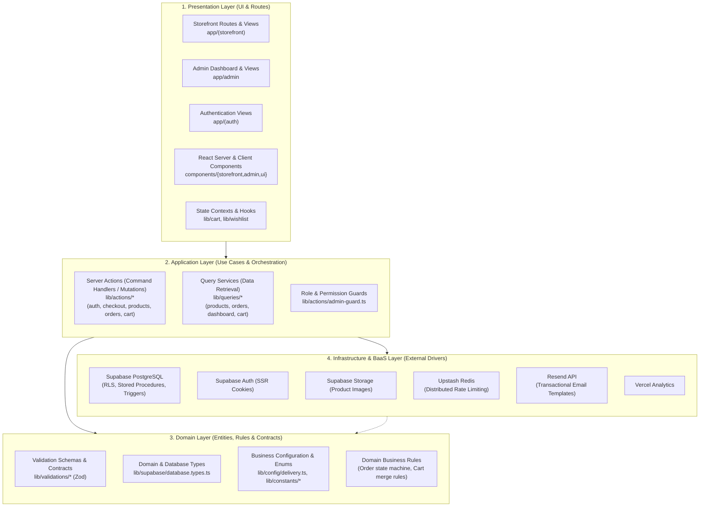

# Bashtoli

> Modern, full-stack e-commerce platform for handcrafted items, custom apparel, and artisan goods. Built with **Next.js 16 (App Router)**, **React 19**, **Supabase (PostgreSQL + Auth + Storage)**, **Tailwind CSS v4**, and **Upstash Redis**.

---

## 🏛️ Clean Architecture & System Design

Bashtoli is engineered following **Clean Architecture** and **Layered Hexagonal (Ports & Adapters)** principles within a unified Next.js App Router monolith. Business logic, data access, domain entities, and presentation concerns are decoupled through strict inward dependency boundaries.

### Architectural Layer Diagram



### Layer Responsibilities & Directory Mapping

| Layer | Directory / Module | Responsibilities & Patterns |
|---|---|---|
| **1. Presentation** | `app/`<br/>`components/`<br/>`lib/cart/`, `lib/wishlist/` | - **App Router Routes & Layouts**: Server-rendered storefront (`(storefront)`), administrative dashboards (`admin/`), and authentication routes (`(auth)`).<br/>- **React Server Components (RSC)**: Streaming UI with Suspense boundaries and localized error boundaries (`error.tsx`, `loading.tsx`).<br/>- **Client State**: Context providers for reactive cart state, wishlist toggles, and toast notifications. |
| **2. Application** | `lib/actions/`<br/>`lib/queries/` | - **Server Actions (Command Pattern)**: Handle state mutations (checkout, order cancellation, product management) with explicit authorization checks.<br/>- **Query Services**: Read-only database operations optimized for data fetching without side effects.<br/>- **Boundary Guards**: `admin-guard.ts` verifies staff/admin privileges before executing privileged operations. |
| **3. Domain** | `lib/validations/`<br/>`lib/config/`<br/>`lib/constants/`<br/>`lib/supabase/database.types.ts` | - **Zod Schemas**: Strict runtime validation and type inference for client inputs, checkout payloads, and product specs.<br/>- **Business Contracts**: State machine transition rules for order lifecycles (`pending` → `confirmed` → `shipped` → `delivered` / `cancelled`).<br/>- **Domain Rules**: Stock decrement invariants, cart conflict resolution strategies, and delivery zone fees. |
| **4. Infrastructure** | `lib/supabase/`<br/>`lib/email/`<br/>`proxy.ts`<br/>`supabase/migrations/` | - **Supabase Client / SSR**: Cookie-based server and browser client wrappers (`@supabase/ssr`).<br/>- **Data Layer Isolation**: PostgreSQL Row Level Security (RLS) policies and PL/pgSQL atomic stored procedures.<br/>- **Edge Services**: Distributed token-bucket rate limiting via Upstash Redis; transactional notifications via Resend. |

### Architectural Invariants & Dependency Rules

1. **Inward Dependency Rule**: Outer layers (Presentation) depend on inner abstractions (Application & Domain). The domain logic and schemas have zero dependencies on presentation components or UI frameworks.
2. **Server Action Decoupling**: Server Actions act as application controllers. They parse and validate input via domain Zod schemas, execute permission checks, orchestrate database transactions, and trigger notifications.
3. **Database-Level Invariants**: High-risk financial and inventory operations (e.g., placing orders, decrementing inventory) run via transactional PostgreSQL functions with row-level locks (`SELECT ... FOR UPDATE`), preventing concurrent race conditions and negative inventory.

---

## 💻 Technology Stack & Engineering Rationale

| Category | Technology | Version | Engineering Rationale & Architectural Role |
|---|---|---|---|
| **Core Framework** | [Next.js](https://nextjs.org/) | `16.2.x` | Next.js App Router provides hybrid rendering (RSC + SSR), streaming architectures, server actions, nested layouts, and edge routing. |
| **UI Library** | [React](https://react.dev/) | `19.2.x` | Utilizes React 19 concurrent features, Server Actions, Transitions, and experimental React Compiler-ready patterns. |
| **Language** | [TypeScript](https://www.typescriptlang.org/) | `5.x` | End-to-end type safety spanning PostgreSQL schema types, domain models, Zod validation schemas, and frontend UI props. |
| **Styling & Design** | [Tailwind CSS](https://tailwindcss.com/) | `4.x` | Tailwind v4 with `@tailwindcss/postcss` delivers high performance, zero-runtime CSS bundle sizes, and consistent responsive design tokens. |
| **Icons** | [Lucide React](https://lucide.dev/) | `1.35.x` | Lightweight, tree-shakeable icon set matching clean modern UI guidelines. |
| **BaaS & Database** | [Supabase](https://supabase.com/) | `Postgres 15+` | Managed PostgreSQL with native Row Level Security (RLS), real-time capabilities, SQL functions, triggers, and automated backups. |
| **Database Access** | `@supabase/supabase-js`<br/>`@supabase/ssr` | `2.110.x`<br/>`0.12.x` | Cookie-based session storage compliant with Next.js App Router server components, route handlers, and middleware. |
| **Object Storage** | Supabase Storage | — | Bucket storage for high-resolution product imagery and marketing banners with CDN caching. |
| **Validation & Schemas** | [Zod](https://zod.dev/) | `4.x` | Single source of truth for runtime validation, API payload sanitization, and automated TypeScript type inference. |
| **Rate Limiting & Cache**| [Upstash Redis](https://upstash.com/) | `@upstash/redis` `1.38.x`<br/>`@upstash/ratelimit` `2.0.x` | Serverless, HTTP-based distributed Redis providing token-bucket rate limiting against DDoS and checkout abuse. |
| **Transactional Email** | [Resend](https://resend.com/) | `6.17.x` | Transactional email delivery with JSX-rendered email templates (`@react-email`) for order confirmation and status changes. |
| **Observability** | [Vercel Analytics](https://vercel.com/analytics) | `2.0.x` | Privacy-focused real user monitoring (RUM) and Core Web Vitals tracking without cookie-consent overhead. |
| **Unit / Integration Testing**| [Vitest](https://vitest.dev/)<br/>Testing Library | `4.1.x`<br/>`16.3.x` | Fast, ESM-native test runner for business utilities, domain logic, and React component integration suites. |
| **E2E Testing** | [Playwright](https://playwright.dev/) | `1.61.x` | Cross-browser automated browser testing validating end-to-end customer checkout and admin workflows. |

---

## 🚀 Dual-Sided Feature Capabilities

### 🛍️ Customer Storefront Experience

- **Catalog & Discovery**:
  - Category-based product organization, search, and attribute filtering.
  - Responsive product cards with stock status badges and responsive image galleries.
- **Product Detail Pages (PDP)**:
  - Multi-attribute variant selector (size, color, material) with real-time SKU and price calculation.
  - Real-time inventory status reflection (In Stock, Low Stock, Sold Out).
  - Open Graph dynamic metadata and JSON-LD structured schemas for search engine indexing.
- **Hybrid Shopping Cart**:
  - **Guest Cart**: Unauthenticated visitors manage carts in `localStorage` without requiring account creation.
  - **Account Cart**: Synchronized server-side in PostgreSQL (`carts` + `cart_items`).
  - **Intelligent Merge on Login**: Automatically consolidates guest items into the authenticated customer cart, selecting maximum quantities and pruning inactive items.
- **Frictionless COD Checkout**:
  - Cash-on-Delivery checkout flow with district-specific delivery fee calculations.
  - Atomic stock verification during order submission to prevent concurrent overselling.
- **Order Tracking & Account Portal**:
  - **Guest Order Lookup**: Order status verification by Order Number + Phone number without login.
  - **Customer Accounts**: Full order history, item breakdowns, tracking links, saved shipping addresses, and customer wishlist.
  - **Self-Service Cancellation**: Customers can cancel orders directly within a 24-hour grace window if status is `pending`.

---

### 🛡️ Admin & Operational Dashboard

- **Protected Role-Based Access Control (RBAC)**:
  - Multi-tiered permissions (`customer`, `staff`, `admin`) enforced via Next.js middleware and PostgreSQL RLS.
  - Full staff authorization delegation managed by administrators.
- **Comprehensive Catalog Management**:
  - Full Product CRUD with title, description, category taxonomy, and base pricing.
  - **Matrix Variant Management**: Generate, configure, and track distinct SKUs, prices, and stock counts per variant.
  - Drag-and-drop product gallery management with Supabase Storage integration.
- **Visual Storefront CMS**:
  - **Hero Carousel Manager**: Add, reorder, update, and toggle homepage promotional banner slides.
  - **Category Collage Manager**: Interactive category spotlight editor for homepage curation.
- **Order Management & Fulfillment Machine**:
  - Comprehensive order dashboard filtered by status (`pending`, `confirmed`, `shipped`, `delivered`, `cancelled`).
  - Single-click status transitions with automatic customer notification email triggers.
  - **Automated Stock Restitution**: Order cancellation (by customer or staff) automatically increments inventory counts back into stock.

---

## 🔒 Security, Concurrency & Data Integrity

### Defense-in-Depth Security Matrix

```
   ┌────────────────────────────────────────────────────────┐
   │               Edge: Cloudflare / Vercel                │
   └───────────────────────────┬────────────────────────────┘
                               │
                               ▼
   ┌────────────────────────────────────────────────────────┐
   │         Next.js Middleware (Role & Route Guards)       │
   └───────────────────────────┬────────────────────────────┘
                               │
                               ▼
   ┌────────────────────────────────────────────────────────┐
   │     Upstash Redis Token-Bucket Rate Limiting (API)     │
   └───────────────────────────┬────────────────────────────┘
                               │
                               ▼
   ┌────────────────────────────────────────────────────────┐
   │      Zod Schema Validation (Server Action Gate)        │
   └───────────────────────────┬────────────────────────────┘
                               │
                               ▼
   ┌────────────────────────────────────────────────────────┐
   │      PostgreSQL Row Level Security (RLS Policies)      │
   └────────────────────────────────────────────────────────┘
```

1. **PostgreSQL Row Level Security (RLS)**:
   - All catalog tables, carts, orders, and profiles have explicit RLS policies.
   - Customers can only read their own orders, addresses, and carts; staff members are granted granular read/update privileges; administrative privileges are restricted to verified roles.
2. **Atomic Inventory Transactions**:
   - Stock decrements and orders are processed within a PostgreSQL transactional function (`place_order`).
   - Row-level locking ensures that concurrent checkouts for low-inventory items fail safely rather than allowing negative stock balances.
3. **Distributed Rate Limiting**:
   - Upstash Redis token-bucket rate limiters guard checkout mutations and guest order lookup endpoints to mitigate automated card testing, denial-of-service, or brute-force order scanning.
4. **Secret Isolation**:
   - The Supabase Service Role key is restricted exclusively to isolated server-side routines, ensuring zero leakage to client-side bundles.

---

## 📚 Technical Documentation Index

For in-depth technical specifications, architectural details, and database documentation, refer to the `docs/` suite:

- **[Product Requirements Document (PRD)](./docs/prd.md)**: Product scope, user personas, operational workflows, and delivery milestones.
- **[System Architecture](./docs/architecture.md)**: Deep dive into application layers, authentication lifecycles, and email routing.
- **[Database Schema & Migrations](./docs/database.md)**: Entity-relationship definitions, indexes, RLS policies, and triggers.
- **[Technology Stack Rationale](./docs/tech-stack.md)**: Extended evaluations and architectural tradeoffs.
- **[Testing Strategy](./docs/testing.md)**: Unit testing patterns with Vitest and E2E specifications with Playwright.
- **[Deployment & Infrastructure](./docs/deployment.md)**: Vercel deployment configurations and environment management.

